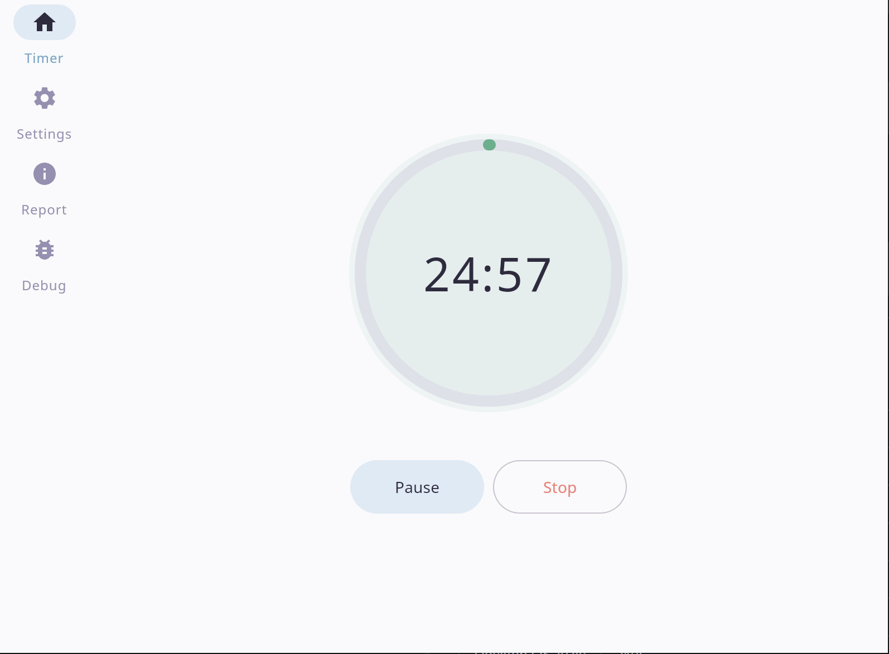
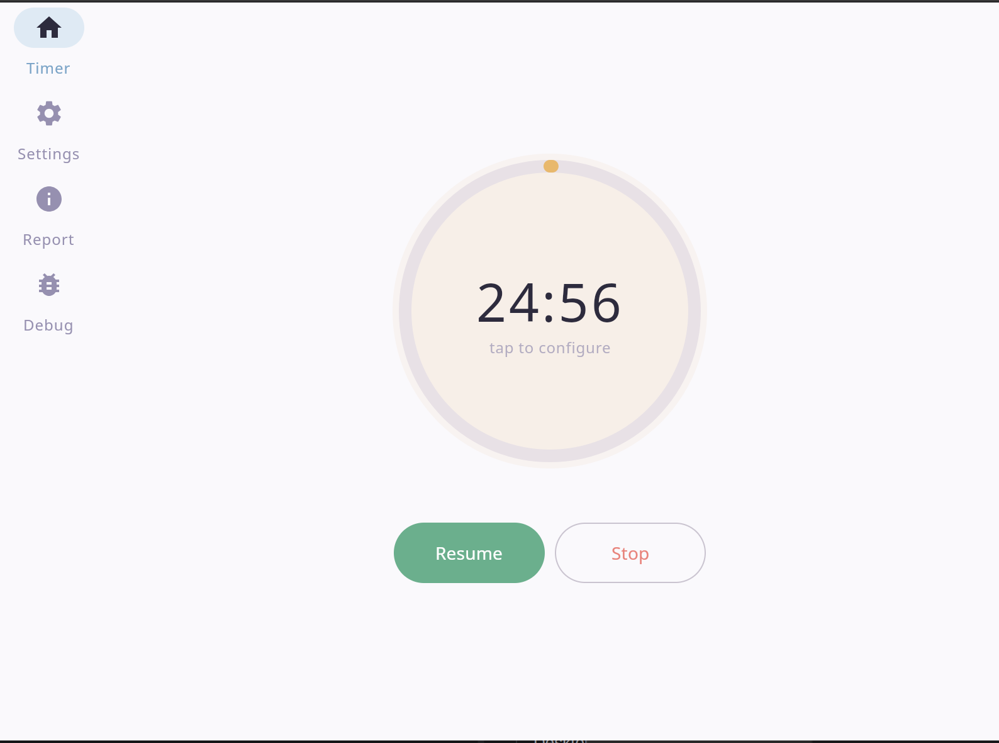
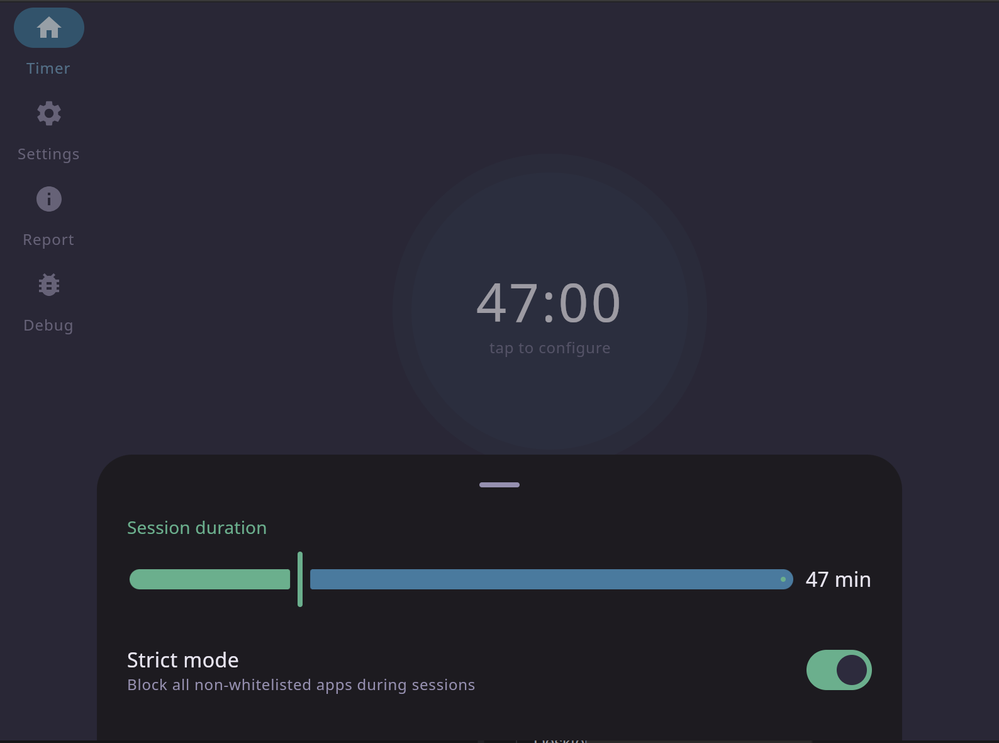
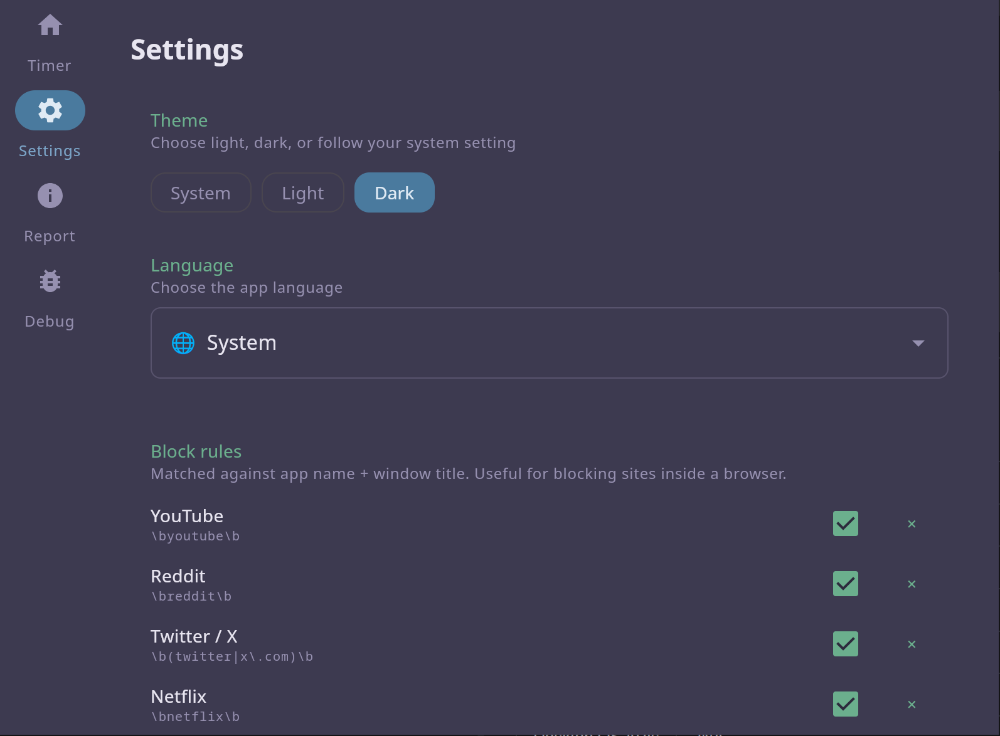
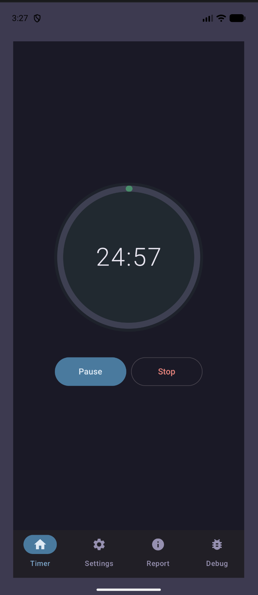
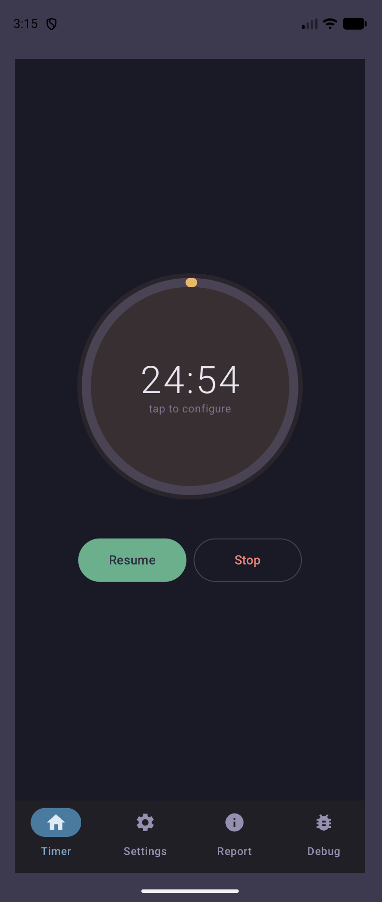
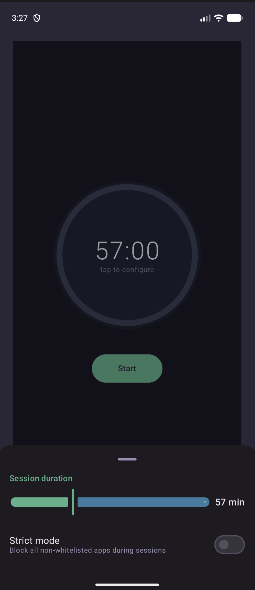
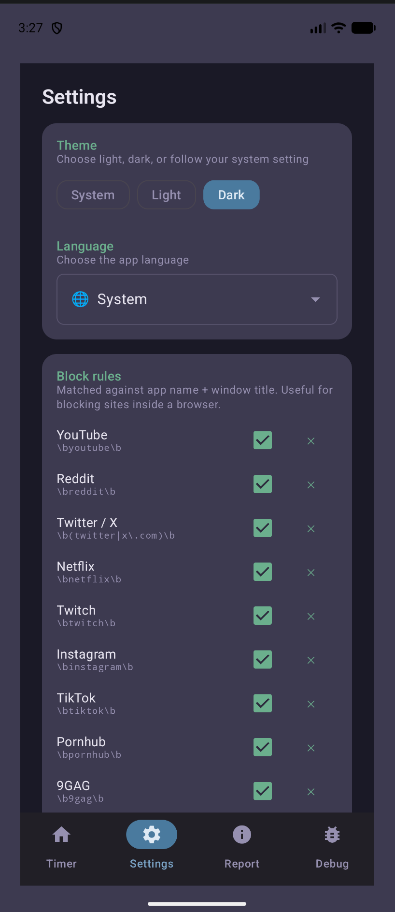

# OpenJetTracks

A rigorous, cross-platform productivity tool that forces you to stay on task. Unlike passive Pomodoro timers, OpenJetTracks actively monitors your environment across PC and Android, detects distracting apps, and intervenes to keep you focused.

**Targets:** Android · Desktop (JVM — Windows / macOS / Linux)

---

## Screenshots

### Desktop

| Timer running | Timer paused | 
|---|---|
|  |  | 

| Duration selection| Block list |
|---|---|
|  |  |
### Android

| Timer running | Timer paused | Duration selection | Block list |
|---|---|---|---|
|  |  |  |  |

---

## Features

- **Unified Timer** — start a session on desktop, Android enters focus mode instantly via sync server
- **Active Distraction Monitoring** — polls OS for active window / foreground app (no screen recording)
- **Intervention** — full-screen blocking overlay or force-close of unauthorized apps
- **Strict Mode** — prevents usage of non-whitelisted apps entirely; configurable per-session
- **App Block List** — choose which apps are blocked during focus sessions
- **Offline Resilience** — sessions tracked locally, synced when connection is available
- **Reports** — post-session review showing focused vs. distracted time
- **Theme** — light, dark, and system-default
- **Localization** — English, Czech, Slovak, French, Spanish, Esperanto, Japanese

---

## Architecture

Three Gradle modules:

| Module | Role |
|---|---|
| `:shared` | KMP library — domain models, repositories, tracking client, `expect/actual` platform abstractions |
| `:composeApp` | KMP app — Compose Multiplatform UI + platform entry points (Android, Desktop, Web) |
| `:server` | JVM-only Ktor sync server — synchronizes sessions between devices |

---

## Building & Running

### Server (start this first for multi-device sync)

```shell
./gradlew :server:run
```

### Desktop

```shell
./gradlew :composeApp:run
```

### Android

```shell
./gradlew :composeApp:assembleDebug
```

Or use the run configuration in your IDE.

### Web (Wasm — modern browsers)

```shell
./gradlew :composeApp:wasmJsBrowserDevelopmentRun
```

---

## Tech Stack

| Concern | Library |
|---|---|
| UI | Compose Multiplatform |
| Async / State | Coroutines + Flow |
| Networking | Ktor Client + Ktor Server |
| Desktop OS APIs | qdbus, journalctl (KDE/Wayland) |
| Android OS APIs | UsageStatsManager, AccessibilityService |
